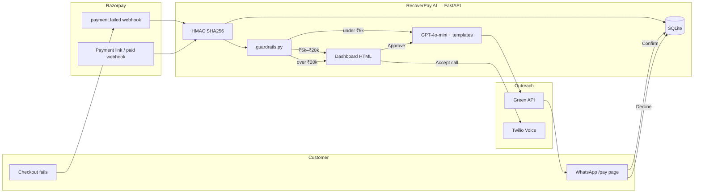

# RecoverPay AI

**Failed Indian checkouts become 1-click WhatsApp recoveries — with Python guardrails the LLM cannot skip.**

Razorpay AI Buildathon 2026 · **Track 03: AI Revenue Recovery**

---

## Links

| | |
|---|---|
| **Repo** | [github.com/Venkateswaran-A-G/recoverpay-ai](https://github.com/Venkateswaran-A-G/recoverpay-ai) |
| **Demo** | Local only — [http://localhost:8000](http://localhost:8000) after `run.bat` / `./run.sh`. **No cloud deployment.** |
| **Slide deck** | _Add your deck URL_ |
| **5-min pitch video** | _Add your Loom / YouTube URL_ |

---

## Team

| Name | Role | GitHub |
|---|---|---|
| Venkateswaran A G | Builder — product, FastAPI engine, dashboard, AI agent, integrations | [Venkateswaran-A-G](https://github.com/Venkateswaran-A-G) |

---

## Problem & solution

### Problem

In India, **15–20% of checkouts fail** at the last step — bank timeout, low balance, OTP drop. Merchants send a generic email a day later. Almost nobody comes back. That is **revenue leakage**: on ₹1 Cr monthly GMV, roughly **₹15–30 L** never lands.

You cannot silently retry UPI. The customer has left. Email open rates are poor. There is no audit trail, no stopping rule, and no proof that money came back.

### Solution

**RecoverPay AI** is an event-driven recovery engine. When Razorpay fires `payment.failed`:

1. Verify the webhook with **HMAC SHA256** (raw body). Bad signature → **401**.
2. Run a **deterministic Python state machine** — opt-out → max **2** retries → **₹5,000** auto-WhatsApp cap → **₹20,000** voice permission (no auto-dial).
3. **GPT-4o-mini** diagnoses the failure and writes **dual-script** WhatsApp (Kannada + Kanglish, Tamil + Tanglish, Hindi + Hinglish). The model cannot move money or skip gates.
4. Send a public **`/pay/{id}`** link. Customer **Confirm** → `RECOVERED`. **Decline** → `OPTED_OUT` (phone registered, no more outreach).

**What we shipped**

- Merchant dashboard (metrics, funnel, human review, 3s refresh)
- Batch simulator (**Simulate 20 Failed Payments**)
- Append-only audit trail
- Green API WhatsApp + Twilio Voice (merchant Accept only)
- Bank-health widget and PII masking on the UI
- `pytest` suite

---

## Tech stack & architecture

| Layer | What we use |
|---|---|
| **Backend** | Python, FastAPI, Uvicorn, Pydantic v2 |
| **Dashboard** | Single-page `frontend/index.html` (Tailwind) served by FastAPI at `/` |
| **Database** | SQLite (`recoverpay.db`) via SQLAlchemy — swap `DATABASE_URL` for PostgreSQL |
| **AI** | OpenAI GPT-4o-mini (JSON mode) + regional fallback templates |
| **Payments** | Razorpay payment links + HMAC webhooks |
| **WhatsApp** | Green API |
| **Voice** | Twilio Voice (amounts **> ₹20,000**, merchant must Accept) |
| **Tests** | pytest |

The original spec mentioned Next.js. The live MVP is **one FastAPI process, one port** so a judge can run `run.bat` and see the engine.



**Guardrail order (not the LLM):** opt-out registry → retry cap **2** → amount **> ₹5,000** → `FLAGGED_FOR_APPROVAL`. Amount **> ₹20,000** → `REQUIRES_VOICE_CALL_PERMISSION`.

---

## Quickstart

### Prerequisites

- **Python 3.11+** (3.13 works on this repo)
- **Git**
- Optional for a live demo: OpenAI key, Green API instance, Twilio Voice, Razorpay test keys

### 1. Clone

```bash
git clone https://github.com/Venkateswaran-A-G/recoverpay-ai.git
cd recoverpay-ai
```

### 2. Virtualenv and install

```bash
python -m venv .venv

# Windows
.venv\Scripts\activate
pip install -r requirements.txt

# macOS / Linux
source .venv/bin/activate
pip install -r requirements.txt
```

### 3. Environment

Copy [`.env.example`](.env.example) to a **gitignored** `.env` and fill what you need.

```env
OPENAI_API_KEY="sk-proj-..."
RAZORPAY_KEY_ID="rzp_test_..."
RAZORPAY_KEY_SECRET="test_secret_..."
RAZORPAY_WEBHOOK_SECRET="demo_secret_12345"
DATABASE_URL="sqlite:///./recoverpay.db"
TEST_MODE="true"
DASHBOARD_API_KEY="demo_dashboard_key"

GREEN_API_INSTANCE_ID="your_instance_id"
GREEN_API_TOKEN="your_green_api_token"
MY_PERSONAL_WHATSAPP="+919XXXXXXXXX"

# PUBLIC_BASE_URL="https://your-public-host.example"

TWILIO_ACCOUNT_SID="ACxxxxxxxxxxxxxxxxxxxxxxxxxxxxxxxx"
TWILIO_AUTH_TOKEN="your_twilio_auth_token"
TWILIO_PHONE_NUMBER="+1XXXXXXXXXX"
```

| Flag | Effect |
|---|---|
| `TEST_MODE=true` | No live OpenAI / WhatsApp / Twilio. Templates + pytest-safe. |
| `TEST_MODE=false` | Live outreach. Dashboard calls send `X-API-KEY: demo_dashboard_key`. |
| `PUBLIC_BASE_URL` | Leave unset for local demo. The app opens a Cloudflare tunnel so a phone can tap `/pay/{id}`. |

**Never commit `.env`.** Placeholders stay in `.env.example`.

### 4. Run

**Windows (1-click):** double-click `run.bat`  
**macOS / Linux:** `chmod +x run.sh && ./run.sh`

Or:

```bash
python -m uvicorn backend.main:app --host 0.0.0.0 --port 8000 --reload
```

Then open **http://localhost:8000**

| URL | What |
|---|---|
| `/` | Merchant dashboard |
| `/health` | Liveness + `test_mode` |
| `/pay/{id}` | Customer Confirm / Decline |

### 5. Demo in 60 seconds

1. Click **Simulate 20 Failed Payments**.
2. Small amounts → `RECOVERY_DISPATCHED`. Amber **> ₹5,000** → Human Review. Rose **> ₹20,000** → voice banner (real name + amount).
3. **Inspect Audit** on a row.
4. **Open pay page** → **Confirm** (`RECOVERED`) or **Decline** (`OPTED_OUT`).

### 6. Tests

```bash
pytest
```

---

## Guardrails (non-negotiable)

- Amount **> ₹5,000** → never auto-dispatch WhatsApp.
- Amount **> ₹20,000** → never auto-dial; merchant Accept / Decline.
- **`retry_count >= 2`** → `MAX_RETRIES_REACHED`.
- Phone in `opt_out_registry` → `OPTED_OUT`.
- Phones / emails **masked** on the dashboard (`+91 98*****1234`).
- We never store PAN / CVV. Checkout stays on Razorpay.

---

*Hybrid agent: GPT writes the message. Python owns money, retries, consent, and cryptographic trust.*
